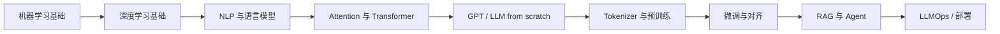

# 机器于此理解语言

> 一个AI炼丹师的大模型学习笔记。

[](https://github.com/Ferris-Liu/LLM-Start-from-the-scratch/actions/workflows/deploy.yml)
[](LICENSE)

这是一个面向中文读者的 LLM 学习入口：从机器学习基础、Transformer、Mini-GPT，到预训练、微调、RAG、Agent 和部署，尽量把每一章都写到能理解、能运行、能复现。

在线阅读：[Docs](https://ferris-liu.github.io/LLM-Start-from-the-scratch)  
仓库展示名：`then-language-generates-by-computer`

---

## 你能在这里得到什么

如果你跟着这份笔记往下走，目标是同时获得三样东西：

- 系统理解 LLM 全链路
- 每章都看到公式、代码、实验
- 最终沉淀成可展示的项目与技术表达

## Start Here

| 入口 | 适合谁 | 去哪里 |
|------|--------|--------|
| 在线首页 | 想先看整体风格和目录结构 | [Docs](docs/index.md) |
| 新读者入口 | 第一次来，不知道从哪里开始 | [如何阅读这本书](docs/how-to-read.md) |
| Transformer 入口 | 想直接进入核心原理 | [Attention 机制](docs/book/05-attention.md) |
| 项目入口 | 想先看 from-scratch 项目感内容 | [从零实现一个 Mini-GPT](docs/book/07-mini-gpt.md) |
| 全书地图 | 想先浏览章节规划和路线 | [路线图](docs/roadmap.md) |

## 为什么值得收藏

- 不是只讲 API 调用，而是从底层原理一路写到工程实践
- 内容按长期学习主线组织，适合反复回看
- 目标不是“学过”，而是把知识沉淀成代码、项目和表达能力

## 当前进度

| 模块 | 状态 | 说明 |
|------|------|------|
| 第 1 章：基础补齐 | 已具备较完整正文 | 可直接阅读，继续打磨中 |
| Transformer / Mini-GPT | 优先推进 | 作为全书样板章重点完善 |
| 预训练 / 微调 / RAG / Agent / 部署 | 持续补齐中 | 按主线逐步展开 |

## 学习路线图



## 适合谁

这套笔记面向希望真正理解语言模型内部机制，而不只停留在工具调用层的学习者。

如果你在意的是下面这些问题，那它就是写给你的：

- Transformer 为什么这样设计
- 预训练到底在学什么
- 微调、RAG、Agent 分别解决什么问题
- 一个大模型项目怎样从原理走到工程落地

## 推荐入口

### 如果你是初学者

- [第 1 章：机器学习与深度学习最小必要基础](docs/book/01-ml-dl-basics.md)
- [如何阅读这本书](docs/how-to-read.md)

### 如果你想先看核心内容

- [第 5 章：Attention 机制](docs/book/05-attention.md)
- [第 7 章：从零实现一个 Mini-GPT](docs/book/07-mini-gpt.md)

### 如果你想先看应用链路

- [第 16 章：RAG 从原理到项目](docs/book/16-rag.md)
- [第 17 章：Agent 与 Tool Calling](docs/book/17-agent-tool-calling.md)

## 主线参考

这套笔记主要沿着三条主线组织：

- [Stanford CS336: Language Modeling from Scratch](https://stanford-cs336.github.io/spring2025/)
- [Hugging Face LLM Course](https://huggingface.co/learn/llm-course/chapter1/1)
- [Build a Large Language Model (From Scratch)](https://www.manning.com/books/build-a-large-language-model-from-scratch)

它们分别对应三种能力：

- `CS336`：理解语言模型的完整开发流程
- `Hugging Face`：掌握 Transformers、数据处理、微调与工具链
- `From Scratch`：从零实现 GPT 风格模型，理解训练与推理细节

## 全书结构

### Part 0：学习路线与岗位定位

- 第 0 章：大模型岗位地图与学习路线

### Part 1：基础补齐

- 第 1 章：机器学习与深度学习最小必要基础
- 第 2 章：PyTorch 与训练循环

### Part 2：NLP 与语言模型基础

- 第 3 章：NLP 基础与文本表示
- 第 4 章：从 n-gram 到神经语言模型

### Part 3：Transformer 核心

- 第 5 章：Attention 机制
- 第 6 章：Transformer 架构
- 第 7 章：从零实现一个 Mini-GPT

### Part 4：现代 LLM 训练流程

- 第 8 章：Tokenizer 与数据处理
- 第 9 章：预训练 Pretraining
- 第 10 章：Scaling Law 与大模型为什么变大
- 第 11 章：LLM 评估

### Part 5：后训练与微调

- 第 12 章：Supervised Fine-Tuning，SFT
- 第 13 章：参数高效微调：LoRA / QLoRA / PEFT
- 第 14 章：偏好对齐：RLHF / DPO / RLAIF

### Part 6：LLM 应用工程

- 第 15 章：Embedding、向量数据库与语义检索
- 第 16 章：RAG 从原理到项目
- 第 17 章：Agent 与 Tool Calling
- 第 18 章：LLMOps、部署与生产化

完整提纲和阶段安排见 [docs/roadmap.md](docs/roadmap.md)。

## 项目路线

这套笔记会尽量沉淀成几类可展示项目：

1. `Mini-GPT from Scratch`
2. `LoRA Fine-tuning 中文任务`
3. `Course Notes RAG Assistant`
4. `LLM Evaluation Benchmark`

目标不是只会“学过”，而是能把学习过程整理成：

- 代码仓库
- README / 技术文档
- 实验记录
- 博客或复盘材料

## 为什么值得收藏

这个仓库适合作为一个长期跟读的中文 LLM 学习入口：

- 持续更新，不是一次性写完的静态笔记
- 主线清晰，从底层原理一路到工程实践
- 每章尽量配代码、公式和项目化输出
- 适合收藏后反复回看，而不是看完即走

如果这些方向正好也是你要补的，那欢迎把它加入收藏夹或点个 star。

## 仓库结构

```text
then-language-generates-by-computer/
├── README.md
├── docs/
│   ├── index.md
│   ├── about-author.md
│   ├── preface.md
│   ├── how-to-read.md
│   ├── roadmap.md
│   ├── book/
│   │   ├── index.md
│   │   ├── 00-role-roadmap.md
│   │   ├── 01-ml-dl-basics.md
│   │   ├── ...
│   │   └── 18-llmops-deployment.md
│   └── assets/
├── mkdocs.yml
└── requirements-docs.txt
```

## 当前状态

- 视觉和阅读体验持续打磨中
- 第 1 章已具备较完整正文
- Transformer / Mini-GPT 相关章节优先作为样板章推进

## License

MIT © FerrisLIU
