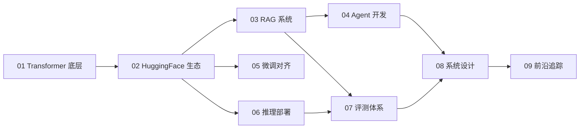

# 从零学习大模型工程

欢迎来到这份开源学习笔记。它记录我系统自学 LLM 工程的过程：从 Transformer 底层原理，到 HuggingFace、RAG、Agent、微调、推理部署和系统设计。

这不是已经完成的权威教材，而是一份持续更新的学习日志。我会尽量把每个主题写成“能理解、能运行、能复现”的形式，也会记录学习中的误解、卡点和工程细节。

!!! tip "学习建议"
    建议按主线阅读，但不要只看文字。遇到公式、张量形状或代码片段时，最好自己跑一遍、改一改，再继续往后读。

## 当前状态

| 状态 | 含义 |
|------|------|
| 已展开 | 已经有较完整的解释、公式或代码 |
| 进行中 | 有提纲或部分内容，后续会继续补充 |
| 计划中 | 当前只是占位，路线可能调整 |

## 学习路径

## 模块一览

| 模块 | 主题 | 适合方向 | 状态 |
|------|------|---------|------|
| [01 · Transformer 精通](01-transformer/index.md) | Attention / KV Cache / 架构对比 | 全方向必学 | 进行中 |
| [02 · HuggingFace 生态](02-huggingface/index.md) | Transformers / PEFT / Datasets | 应用 / 部署 | 计划中 |
| [03 · RAG 系统](03-rag/index.md) | 向量检索 / 混合搜索 / 评测 | 应用 | 计划中 |
| [04 · Agent 开发](04-agent/index.md) | Function Call / ReAct / MCP | 应用 | 计划中 |
| [05 · 微调与对齐](05-finetune/index.md) | LoRA / SFT / DPO | 研究 / 应用 | 计划中 |
| [06 · 推理部署](06-inference/index.md) | vLLM / 量化 / 压测 | 部署 | 计划中 |
| [07 · 评测体系](07-evaluation/index.md) | LLM-as-Judge / Benchmark | 应用 / 研究 | 计划中 |
| [08 · 系统设计](08-system-design/index.md) | 流式输出 / 缓存 / 监控 | 部署 / 应用 | 计划中 |
| [09 · 前沿追踪](09-frontier/index.md) | Reasoning / MoE / 多模态 | 研究 | 计划中 |

## 写作路线

当前会优先把 [01 · Transformer 精通](01-transformer/index.md) 打磨成样板章，再进入 HuggingFace 和 RAG。更细的更新计划见 [写作路线图](roadmap.md)。

## 配套资源

- **Notebooks**：计划放每章关键概念的可运行代码。
- **Projects**：计划放端到端小项目，例如 miniGPT、RAG、Agent demo。
- **问题讨论**：欢迎在 [GitHub Issues](https://github.com/Ferris-Liu/LLM-Start-from-the-scratch/issues) 提问。

---

*最后更新：{{ git_revision_date_localized }}*
