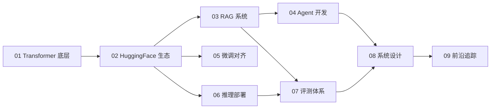

<section class="llm-hero">
  
LLM Engineering Notes

  <h1 class="llm-hero__title">从零学习大模型工程</h1>
  

    一份面向工程实践的开源学习笔记：从 Transformer 底层原理，到 HuggingFace、RAG、Agent、微调、推理部署和系统设计。
    目标不是把概念堆满，而是把每个主题写到能理解、能运行、能复现。
  

  

    Transformer
    RAG
    Agent
    Finetune
    Inference
  

</section>

!!! tip "学习建议"
    建议按主线阅读，但不要只看文字。遇到公式、张量形状或代码片段时，最好自己跑一遍、改一改，再继续往后读。

## 当前状态

| 状态 | 含义 |
|------|------|
| 已展开 | 已经有较完整的解释、公式或代码 |
| 进行中 | 有提纲或部分内容，后续会继续补充 |
| 计划中 | 当前只是占位，路线可能调整 |

## 学习路径

## 模块一览

  <article class="llm-card">
    <h3><a href="01-transformer/">01 · Transformer 精通</a></h3>
    
Attention、位置编码、KV Cache、架构对比和 miniGPT，从底层机制一路写到可运行实现。

    进行中
  </article>
  <article class="llm-card">
    <h3><a href="02-huggingface/">02 · HuggingFace 生态</a></h3>
    
Transformers、Datasets、PEFT 等常用工作流，面向应用和部署打基础。

    计划中
  </article>
  <article class="llm-card">
    <h3><a href="03-rag/">03 · RAG 系统</a></h3>
    
从文档切分、向量检索、混合搜索，到答案生成、评测和错误分析。

    计划中
  </article>
  <article class="llm-card">
    <h3><a href="04-agent/">04 · Agent 开发</a></h3>
    
Function Call、ReAct、MCP 和工具编排，把模型能力接入真实任务。

    计划中
  </article>
  <article class="llm-card">
    <h3><a href="05-finetune/">05 · 微调与对齐</a></h3>
    
LoRA、SFT、DPO 等训练流程，关注从实验到可复用工程管线。

    计划中
  </article>
  <article class="llm-card">
    <h3><a href="06-inference/">06 · 推理部署</a></h3>
    
vLLM、量化、压测、批处理和流式输出，围绕线上性能和成本展开。

    计划中
  </article>
  <article class="llm-card">
    <h3><a href="07-evaluation/">07 · 评测体系</a></h3>
    
LLM-as-Judge、Benchmark、回归测试和质量监控，让改动可比较。

    计划中
  </article>
  <article class="llm-card">
    <h3><a href="08-system-design/">08 · 系统设计</a></h3>
    
缓存、监控、灰度、链路追踪和系统边界，补上工程化最后一环。

    计划中
  </article>
  <article class="llm-card">
    <h3><a href="09-frontier/">09 · 前沿追踪</a></h3>
    
Reasoning、MoE、多模态和新模型架构，用工程视角跟进前沿。

    计划中
  </article>

## 写作路线

当前会优先把 [01 · Transformer 精通](01-transformer/index.md) 打磨成样板章，再进入 HuggingFace 和 RAG。更细的更新计划见 [写作路线图](roadmap.md)。

## 配套资源

- **Notebooks**：计划放每章关键概念的可运行代码。
- **Projects**：计划放端到端小项目，例如 miniGPT、RAG、Agent demo。
- **问题讨论**：欢迎在 [GitHub Issues](https://github.com/Ferris-Liu/LLM-Start-from-the-scratch/issues) 提问。

---

*最后更新：{{ git_revision_date_localized }}*
