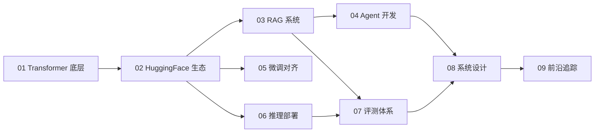

# 从零精通大模型工程

欢迎来到这份开源学习笔记。本教程面向**有深度学习基础、希望系统掌握大模型工程**的同学，覆盖应用开发、推理部署、算法研究三个方向。

!!! tip "学习建议"
    本教程注重**动手实践**。每个模块都有配套代码和项目，建议边读边跑代码。

## 学习路径

## 模块一览

| 模块 | 主题 | 适合方向 |
|------|------|---------|
| [01 · Transformer 精通](01-transformer/index.md) | Attention / KV Cache / 架构对比 | 全方向必学 |
| [02 · HuggingFace 生态](02-huggingface/index.md) | Transformers / PEFT / Datasets | 应用 / 部署 |
| [03 · RAG 系统](03-rag/index.md) | 向量检索 / 混合搜索 / 评测 | 应用 |
| [04 · Agent 开发](04-agent/index.md) | Function Call / ReAct / MCP | 应用 |
| [05 · 微调与对齐](05-finetune/index.md) | LoRA / SFT / DPO | 研究 / 应用 |
| [06 · 推理部署](06-inference/index.md) | vLLM / 量化 / 压测 | 部署 |
| [07 · 评测体系](07-evaluation/index.md) | LLM-as-Judge / Benchmark | 应用 / 研究 |
| [08 · 系统设计](08-system-design/index.md) | 流式输出 / 缓存 / 监控 | 部署 / 应用 |
| [09 · 前沿追踪](09-frontier/index.md) | Reasoning / MoE / 多模态 | 研究 |

## 配套资源

- 📓 **Notebooks**：每章关键概念的可运行代码在 `notebooks/` 目录
- 🔨 **完整项目**：三个端到端项目在 `projects/` 目录
- 💬 **问题讨论**：欢迎在 [GitHub Issues](https://github.com/YOUR_USERNAME/llm-tutorial/issues) 提问

---

*最后更新：{{ git_revision_date_localized }}*
